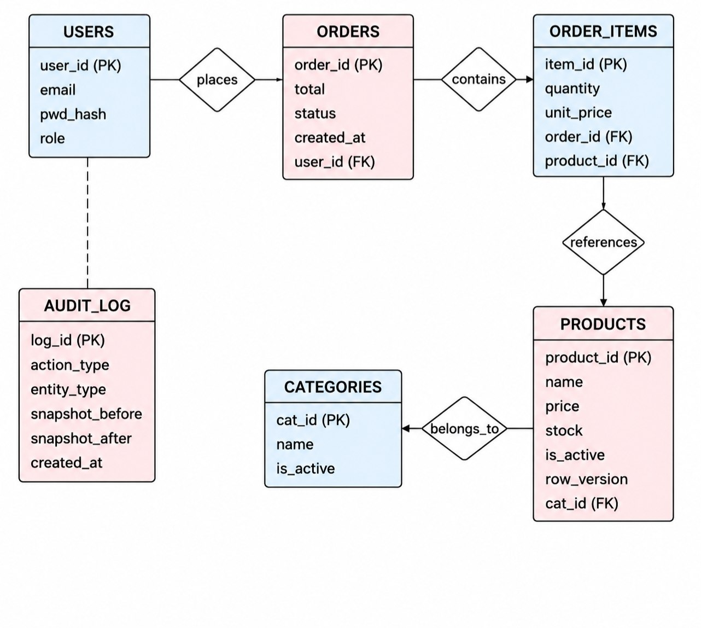
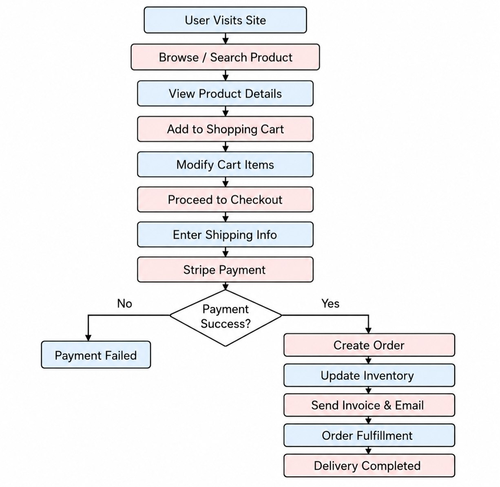
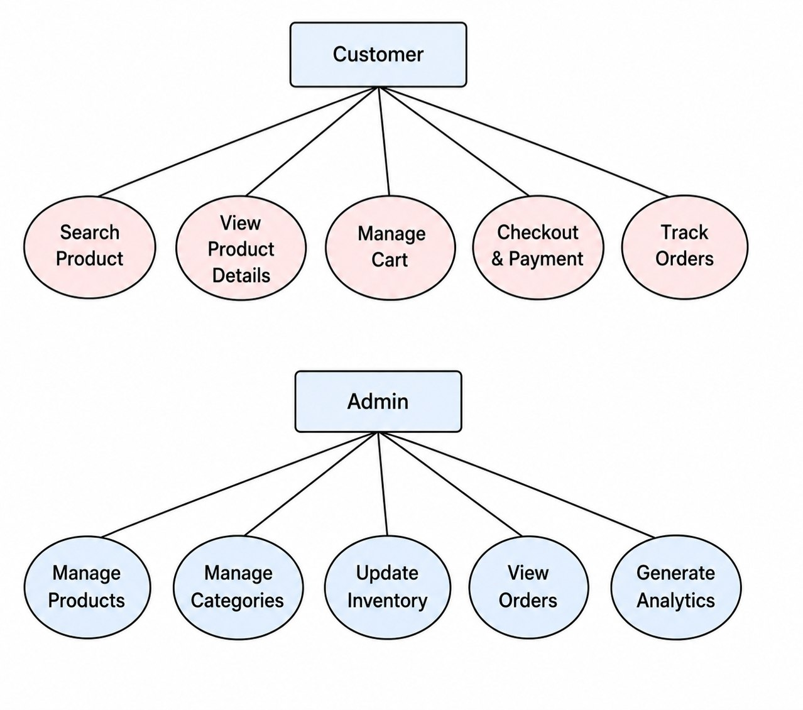
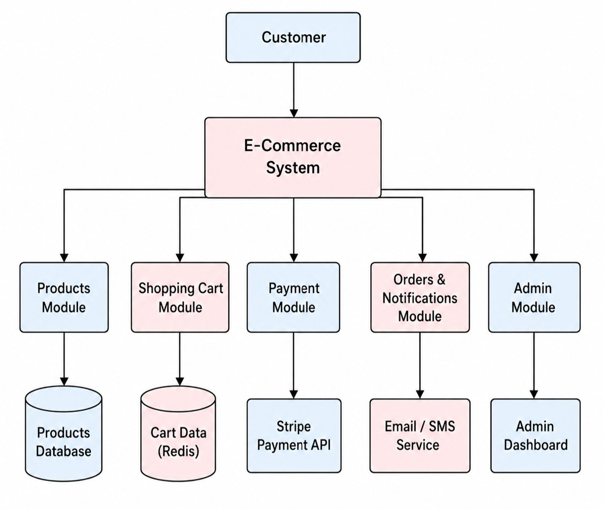
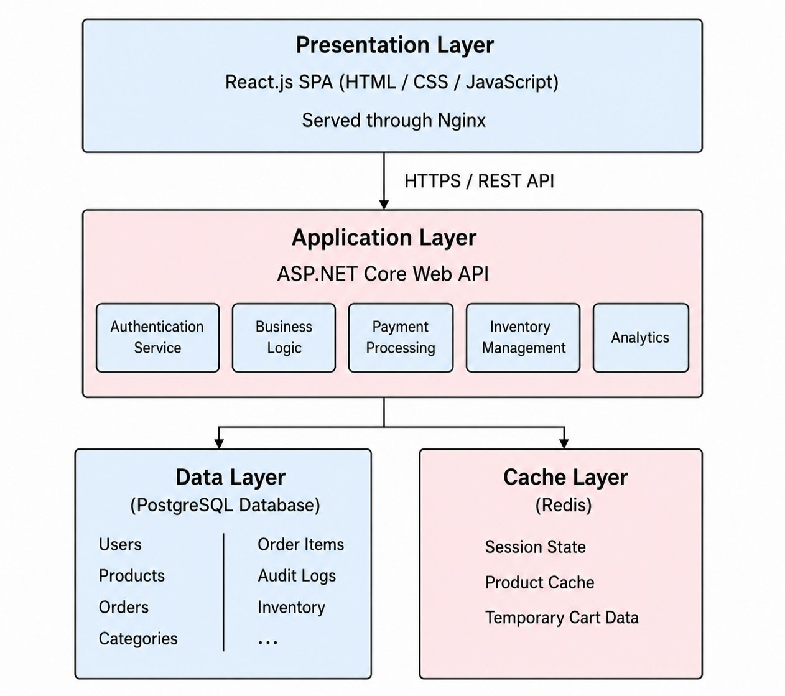

# Mridangini — E-Commerce Platform

> Software Engineering Project | Department of Information Technology, Gauhati University

## Development Team
| Name             | Role                      |
|------------------|---------------------------|
| Abhishek Das     | Frontend                  |
| Gargee Kakaty    | Design, Documentation     |
| Kaustuva Kashyap | Design, Documentation     |
| Ronit Choudhury  | Backend, Documentation    |

---

## 1. Objective
To deliver a fully deployable, high-performance e-commerce platform providing a seamless shopping experience for customers and robust management tools for administrators.

**Key Goals:**
- Functional product catalogue with full-text search and filtering
- Transactionally safe checkout and payment pipeline (Stripe)
- Comprehensive admin tooling for inventory, orders, and analytics
- Data integrity, auditability, and security at all layers
- Containerised deployment via Docker / Docker Compose

---

## 2. Problem Statement
Traditional retail businesses without a digital presence face barriers in reaching customers, managing inventory, and processing transactions securely. Key challenges include:

- Fragmented systems causing data inconsistency
- No real-time inventory tracking → overselling and stockouts
- Insecure payment handling and PCI-DSS compliance risks
- No auditable admin layer for tracking changes
- Poor scalability due to stateful application design
- Limited analytics for data-driven decision making

Mridangini addresses these with an N-tier architecture, Stripe-integrated payments, a finite-state cart machine, and an immutable audit log.

---

## 3. ER Diagram

> Tables: `USERS`, `PRODUCTS`, `CATEGORIES`, `ORDERS`, `ORDER_ITEMS`, `AUDIT_LOG`

---

## 4. Workflow

**Flow:** User Visits Site → Browse/Search → View Product → Add to Cart → Modify Cart → Checkout → Shipping Info → Stripe Payment → (Success: Create Order → Update Inventory → Send Invoice → Fulfillment → Delivery) / (Fail: Payment Failed)

---

## 5. Dataflow
### Customer & Admin Use Cases

### System Module Flow

---

## 6. Architecture

| Tier | Technology | Role |
|------|-----------|------|
| Presentation | React.js SPA + Nginx | UI, routing, state management |
| Application | ASP.NET Core Web API | Business logic, auth, payments |
| Data | PostgreSQL / SQLite + Redis | Persistence + caching |

---

## 7. Tech Stack
- **Frontend:** React.js, Redux / Context API
- **Backend:** ASP.NET Core Web API (.NET 10.0)
- **Database:** PostgreSQL / SQLite (3NF), Redis (cache)
- **Design & Prototyping:** Figma
- **Payments:** Stripe
- **Methodology:** Rapid Application Development (RAD) & Evolutionary Model
- **Deployment:** Docker / Docker Compose

---

## 8. Local Environment Setup
### Prerequisites
- .NET 10.0
- Node.js (for frontend tooling / minification)
- PostgreSQL or SQLite (depending on current phase)

---

## 9. Development Phases & Timeline
| Phase | Period | Focus |
|-------|--------|-------|
| Phase 0: Setup & Planning | May 6 | Repo setup, tech stack, DB schema, API contracts |
| Phase 1: Core MVP | May 7–10 | Product catalog, search, cart, basic checkout |
| Phase 2: Integration & Payments | May 11–13 | Payment gateway, order system, email notifications |
| Phase 3: Admin Dashboard | May 14–16 | Inventory CRUD, order tracking, invoices |
| Phase 4: Stabilization | May 17–18 | Bug fixing, optimization, security |
| Phase 5: Deployment | May 19–20 | Final testing, hosting, responsiveness |

---

## 10. Future Enhancements
- Microservice Transformation
- Dynamic Pricing Module
